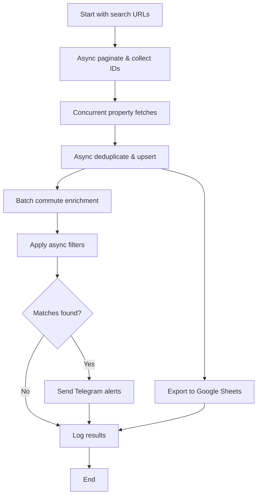

# HomeHunt – Scrape ▶ Filter ▶ Enrich ▶ Alert ▶ Export

A minimal Python library + CLI that:

1. Crawls property listings from **Rightmove** and **Zoopla**
2. Deduplicates, normalizes and stores them in a local SQLite DB
3. Enriches each home with **public-transport & cycling commute times** via the free-tier **TravelTime API**
4. Applies user-defined filters (price, beds, commute threshold, etc.)
5. Sends **Telegram alerts** for matches and pushes curated data to Google Sheets

---

## 1. Tech Stack

| Layer | Choice | Notes |
|-------|--------|-------|
| **Python** | 3.11+ | Async-friendly, widely available |
| **Env & deps** | `requirements.txt` | Pin exact versions; see sample below |
| **HTTP** | `httpx` (async) | Built-in retries via `backoff` |
| **HTML parse** | `selectolax` | 3× faster & lighter than BeautifulSoup |
| **Data models** | `pydantic` | Immutable dataclasses for listings & commutes |
| **DB** | **SQLite via `SQLModel`** | Single file, type-safe ORM |
| **Commute API** | **TravelTime** | Free 10k req/day; UK-wide transit + cycling |
| **Alerts** | **python-telegram-bot** | Async; rich keyboards if needed |
| **Sheets** | `gspread-pandas` | Simple DataFrame → Google Sheet upload |
| **CLI** | `Typer` | Auto-docs & colorized help |
| **Logging** | `structlog` + `rich` | Beautiful console output with tracebacks |
| **Async** | `asyncio` + `anyio` | Async-first architecture throughout |

### `requirements.txt`

```
httpx==0.27.2
selectolax==0.3.26
pydantic==2.10.3
sqlmodel==0.0.16
python-dotenv==1.0.1
backoff==2.2.1
typer==0.12.5
structlog==24.4.0
rich==13.9.4
python-telegram-bot==22.1.0
gspread-pandas==3.3.0
pandas==2.2.3
anyio==4.6.2
aiosqlite==0.20.0
```

### `requirements-dev.txt`

```
pytest==8.3.3
pytest-asyncio==0.24.0
pytest-cov==5.0.0
black==24.10.0
ruff==0.6.9
mypy==1.11.2
httpx-mock==0.3.0
faker==25.0.0
```

---

## 2. Repository Layout

```
homehunt/
│
├── cli.py                    # Typer entry-point
├── config.py                 # Configuration management
├── core/
│   ├── models.py            # Pydantic: Property, Commute, etc.
│   ├── db.py                # SQLModel session & helpers
│   ├── scraper/
│   │   ├── base.py          # Abstract scraper class
│   │   ├── rightmove.py     # Rightmove implementation
│   │   └── zoopla.py        # Zoopla implementation
│   ├── dedup.py             # UID logic + fuzzy matching
│   ├── filters.py           # Composable filter functions
│   ├── commute/
│   │   ├── traveltime.py    # TravelTime API wrapper
│   │   └── cache.py         # Commute result caching
│   └── alerts/
│       └── telegram.py      # Telegram notification handler
│
├── exporters/
│   ├── google_sheets.py     # Google Sheets exporter
│   └── csv.py               # CSV export functionality
│
├── utils/
│   ├── logging.py           # Rich + structlog configuration
│   └── async_helpers.py     # Async utilities & semaphores
│
└── tests/                   # Test suite
    ├── test_scrapers.py
    ├── test_filters.py
    └── test_commute.py
```

---

## 3. Core Modules & Responsibilities

### 3.1 Async Architecture & Logging Setup

**Rich Console Configuration (`utils/logging.py`):**
```python
from rich.console import Console
from rich.logging import RichHandler
from rich.progress import Progress, SpinnerColumn, TextColumn
from rich.traceback import install
import structlog

# Install rich traceback handler for beautiful error messages
install(show_locals=True)

console = Console()

def setup_logging():
    structlog.configure(
        processors=[
            structlog.contextvars.merge_contextvars,
            structlog.processors.add_log_level,
            structlog.processors.StackInfoRenderer(),
            structlog.dev.ConsoleRenderer(colors=True)
        ],
        wrapper_class=structlog.make_filtering_bound_logger(logging.INFO),
        logger_factory=structlog.PrintLoggerFactory(file=sys.stderr),
        cache_logger_on_first_use=True,
    )
```

**Async Helpers (`utils/async_helpers.py`):**
```python
import asyncio
from contextlib import asynccontextmanager

# Global semaphores for rate limiting
RIGHTMOVE_SEMAPHORE = asyncio.Semaphore(1)  # 1 req/sec
ZOOPLA_SEMAPHORE = asyncio.Semaphore(1)     # 1 req/sec
TRAVELTIME_SEMAPHORE = asyncio.Semaphore(10) # 10 concurrent requests

@asynccontextmanager
async def rate_limit(semaphore: asyncio.Semaphore, delay: float = 1.0):
    async with semaphore:
        try:
            yield
        finally:
            await asyncio.sleep(delay)
```

### 3.2 Scraper (`core.scraper.*`)

**Base Async Scraper Pattern:**
```python
# core/scraper/base.py
from abc import ABC, abstractmethod
from typing import AsyncIterator
import httpx
from rich.progress import Progress

class BaseScraper(ABC):
    def __init__(self, console: Console):
        self.console = console
        self.client = httpx.AsyncClient(
            timeout=30.0,
            limits=httpx.Limits(max_keepalive_connections=5)
        )
    
    async def __aenter__(self):
        return self
    
    async def __aexit__(self, *args):
        await self.client.aclose()
    
    @abstractmethod
    async def search(self, url: str) -> AsyncIterator[str]:
        """Yield listing IDs from search results"""
        pass
    
    @abstractmethod
    async def fetch_details(self, listing_id: str) -> Property:
        """Fetch and parse property details"""
        pass
```

**Key methods:**
- `async def search(url)` – Yields listing IDs via pagination
  - Rightmove: `&index=N` (0-based, 24 per page)
  - Zoopla: `&pn=N` (1-based, varies per page)
- `async def fetch_details(listing_id)` – Fetches and parses property details

**Important considerations:**
- Use semaphores for rate limiting: **1 request/sec** per host
- Display progress with rich: `Progress(SpinnerColumn(), TextColumn())`
- Cache raw HTML to disk during development
- Handle pagination edge cases (empty results, last page)

### 3.3 Deduplication (`core.dedup`)

**UID Generation:**
```python
uid = f"{portal}:{listing_id}"  # e.g., "rightmove:12345678"
```

**Database constraints:**
- `UNIQUE(uid)` constraint on listings table
- When re-encountering a UID:
  - Update `last_seen` timestamp
  - Track price changes in `price_history` table
  - Update mutable fields (price, availability)

### 3.4 Filters (`core.filters`)

**Async Filter Functions (composable):**
```python
from typing import Callable, Awaitable

# Filter type alias
PropertyFilter = Callable[[list[Property]], Awaitable[list[Property]]]

async def filter_by_commute(
    properties: list[Property], 
    max_minutes: int, 
    mode: str,
    console: Console
) -> list[Property]:
    """Filter properties by commute time"""
    filtered = []
    
    with console.status("[bold blue]Filtering by commute times..."):
        for prop in properties:
            commute_time = getattr(prop, f"commute_{mode}", None)
            if commute_time and commute_time <= max_minutes:
                filtered.append(prop)
        
    console.print(
        f"[green]✓[/green] {len(filtered)}/{len(properties)} properties "
        f"within {max_minutes} min by {mode}"
    )
    return filtered

# Compose filters
async def apply_filters(
    properties: list[Property],
    filters: list[PropertyFilter]
) -> list[Property]:
    for filter_func in filters:
        properties = await filter_func(properties)
    return properties
```

### 3.5 Commute Enrichment (`core.commute.traveltime`)

**Async Implementation with Progress Tracking:**
```python
import asyncio
from rich.progress import Progress, TaskID

class TravelTimeClient:
    def __init__(self, api_key: str, console: Console):
        self.api_key = api_key
        self.console = console
        self.client = httpx.AsyncClient()
        
    async def enrich_properties(
        self, 
        properties: list[Property],
        destination: str
    ) -> list[Property]:
        """Enrich properties with commute times"""
        
        # Geocode destination once
        dest_coords = await self.geocode(destination)
        
        with Progress(console=self.console) as progress:
            task = progress.add_task(
                "[cyan]Fetching commute times...", 
                total=len(properties) * 2  # PT + cycling
            )
            
            tasks = []
            for prop in properties:
                tasks.append(
                    self._enrich_single(prop, dest_coords, progress, task)
                )
            
            return await asyncio.gather(*tasks)
    
    async def _enrich_single(
        self, 
        prop: Property, 
        dest_coords: tuple,
        progress: Progress,
        task_id: TaskID
    ) -> Property:
        """Enrich a single property with both commute modes"""
        async with TRAVELTIME_SEMAPHORE:
            try:
                # Get property coordinates
                prop_coords = await self.geocode(prop.postcode)
                
                # Fetch both modes concurrently
                pt_time, cycle_time = await asyncio.gather(
                    self._get_travel_time(prop_coords, dest_coords, "public_transport"),
                    self._get_travel_time(prop_coords, dest_coords, "cycling"),
                    return_exceptions=True
                )
                
                # Update property
                if not isinstance(pt_time, Exception):
                    prop.commute_public_transport = pt_time
                    progress.advance(task_id)
                
                if not isinstance(cycle_time, Exception):
                    prop.commute_cycling = cycle_time
                    progress.advance(task_id)
                    
                return prop
                
            except Exception as e:
                self.console.print(
                    f"[red]Error enriching {prop.uid}:[/red] {str(e)}"
                )
                return prop
```

### 3.6 Alerts (`core.alerts.telegram`)

**Async Telegram Integration with Rich Formatting:**
```python
from telegram import Bot
from telegram.error import TelegramError
from rich.panel import Panel
from rich.table import Table

class TelegramNotifier:
    def __init__(self, token: str, chat_id: str, console: Console):
        self.bot = Bot(token=token)
        self.chat_id = chat_id
        self.console = console
    
    async def notify_batch(self, properties: list[Property]):
        """Send notifications for multiple properties"""
        
        # Display summary in console
        table = Table(title="New Listings Found", show_header=True)
        table.add_column("Address", style="cyan")
        table.add_column("Price", justify="right", style="green")
        table.add_column("Commute (PT)", justify="right")
        table.add_column("Status", justify="center")
        
        for prop in properties:
            try:
                await self._send_single(prop)
                status = "[green]✓ Sent[/green]"
            except TelegramError as e:
                status = "[red]✗ Failed[/red]"
                self.console.print(f"[red]Telegram error:[/red] {e}")
            
            table.add_row(
                prop.address[:30] + "...",
                f"£{prop.price:,}",
                f"{prop.commute_public_transport} min",
                status
            )
        
        self.console.print(table)
    
    async def _send_single(self, property: Property):
        """Send a single property notification"""
        message = f"""🏡 New Listing Alert!

📍 {property.address}
🛏️ {property.bedrooms} bedrooms
💷 £{property.price:,}
🚇 {property.commute_public_transport} min by public transport
🚴 {property.commute_cycling} min by bike

View on {property.portal.title()}: {property.url}"""
        
        await self.bot.send_message(
            chat_id=self.chat_id,
            text=message,
            parse_mode="HTML"
        )
```

**Configuration (via `.env`):**
```
TELEGRAM_TOKEN=your_bot_token
TELEGRAM_CHAT_ID=your_chat_id
```

### 3.7 Database Schema (`core.db`)

**Async SQLModel Setup:**
```python
from sqlalchemy.ext.asyncio import create_async_engine, AsyncSession
from sqlalchemy.orm import sessionmaker
from sqlmodel import SQLModel, Field, create_engine

# Async engine setup
engine = create_async_engine(
    "sqlite+aiosqlite:///homehunt.db",
    echo=False,
    future=True
)

async_session = sessionmaker(
    engine, class_=AsyncSession, expire_on_commit=False
)

# Models
class Listing(SQLModel, table=True):
    uid: str = Field(primary_key=True)  # "portal:id"
    portal: str
    listing_id: str
    url: str
    postcode: str | None = None
    price: int | None = None
    bedrooms: int | None = None
    property_type: str | None = None
    first_seen: datetime = Field(default_factory=datetime.utcnow)
    last_seen: datetime = Field(default_factory=datetime.utcnow)
    is_active: bool = True
    
    # Commute times (denormalized for query performance)
    commute_public_transport: int | None = None
    commute_cycling: int | None = None

class PriceHistory(SQLModel, table=True):
    id: int | None = Field(default=None, primary_key=True)
    uid: str = Field(foreign_key="listing.uid")
    price: int
    recorded_at: datetime = Field(default_factory=datetime.utcnow)

# Initialize database
async def init_db():
    async with engine.begin() as conn:
        await conn.run_sync(SQLModel.metadata.create_all)
```

### 3.7 Exporters

**Google Sheets (`exporters.google_sheets`):**
- Authenticate using service account credentials
- Overwrite "Listings" tab with current filtered results
- Include columns: URL, Price, Beds, Commute Times, First Seen

**CSV (`exporters.csv`):**
- Export for local analysis/diffing
- Include all database fields

---

## 4. Orchestration Flow



### Main Async Orchestrator

```python
# cli.py
import asyncio
from typing import Optional
import typer
from rich.console import Console
from rich.panel import Panel
from rich.live import Live
from rich.layout import Layout

app = typer.Typer()
console = Console()

@app.command()
def scrape(
    area: str = typer.Option(..., help="Search area (e.g., 'Oxford')"),
    radius_miles: int = typer.Option(10, help="Search radius in miles"),
    min_price: int = typer.Option(0, help="Minimum price"),
    max_price: int = typer.Option(1000000, help="Maximum price"),
    min_beds: int = typer.Option(1, help="Minimum bedrooms"),
    max_commute_pt: Optional[int] = typer.Option(None, help="Max commute by public transport"),
    destination: Optional[str] = typer.Option(None, help="Commute destination postcode"),
    alert: bool = typer.Option(False, "--alert", help="Send Telegram alerts"),
):
    """Run the property scraper with filters"""
    
    # Display config
    console.print(Panel.fit(
        f"[bold cyan]HomeHunt Starting[/bold cyan]\n"
        f"Area: {area} ({radius_miles} miles)\n"
        f"Price: £{min_price:,} - £{max_price:,}\n"
        f"Beds: {min_beds}+\n"
        f"Commute: {max_commute_pt} min to {destination}" if destination else "",
        title="Configuration"
    ))
    
    # Run async main
    asyncio.run(main(area, radius_miles, min_price, max_price, min_beds, 
                     max_commute_pt, destination, alert))

async def main(area, radius_miles, min_price, max_price, min_beds, 
               max_commute_pt, destination, alert):
    
    # Initialize database
    await init_db()
    
    # Create layout for live updates
    layout = Layout()
    layout.split_column(
        Layout(name="header", size=3),
        Layout(name="progress"),
        Layout(name="results")
    )
    
    with Live(layout, console=console, refresh_per_second=4):
        # Update header
        layout["header"].update(Panel("🏡 HomeHunt - Real-time Property Search"))
        
        # Phase 1: Scraping
        layout["progress"].update("[bold yellow]Phase 1/4:[/bold yellow] Scraping properties...")
        
        async with RightmoveScraper(console) as rm_scraper:
            async with ZooplaScraper(console) as z_scraper:
                # Concurrent scraping
                properties = await asyncio.gather(
                    scrape_portal(rm_scraper, area, radius_miles),
                    scrape_portal(z_scraper, area, radius_miles)
                )
                all_properties = [p for portal in properties for p in portal]
        
        layout["results"].update(f"[green]✓[/green] Found {len(all_properties)} properties")
        
        # Phase 2: Deduplication
        layout["progress"].update("[bold yellow]Phase 2/4:[/bold yellow] Deduplicating...")
        
        async with async_session() as session:
            new_properties = await deduplicate_batch(session, all_properties, console)
            await session.commit()
        
        layout["results"].update(f"[green]✓[/green] {len(new_properties)} new properties")
        
        # Phase 3: Enrichment
        if destination and new_properties:
            layout["progress"].update("[bold yellow]Phase 3/4:[/bold yellow] Fetching commute times...")
            
            travel_client = TravelTimeClient(api_key=config.TRAVELTIME_API_KEY, console=console)
            enriched = await travel_client.enrich_properties(new_properties, destination)
            
            # Save enriched data
            async with async_session() as session:
                for prop in enriched:
                    await session.merge(prop)
                await session.commit()
        else:
            enriched = new_properties
        
        # Phase 4: Filtering & Alerts
        layout["progress"].update("[bold yellow]Phase 4/4:[/bold yellow] Applying filters...")
        
        # Build filter pipeline
        filters = [
            lambda props: filter_by_price(props, min_price, max_price, console),
            lambda props: filter_by_beds(props, min_beds, console),
        ]
        
        if max_commute_pt and destination:
            filters.append(
                lambda props: filter_by_commute(props, max_commute_pt, "public_transport", console)
            )
        
        filtered = await apply_filters(enriched, filters)
        
        # Send alerts
        if alert and filtered:
            notifier = TelegramNotifier(
                token=config.TELEGRAM_TOKEN,
                chat_id=config.TELEGRAM_CHAT_ID,
                console=console
            )
            await notifier.notify_batch(filtered)
        
        # Export to sheets
        if filtered:
            exporter = GoogleSheetsExporter(console)
            await exporter.export(filtered)
        
        # Final summary
        layout["progress"].update("[bold green]Complete![/bold green]")
        layout["results"].update(
            Panel(
                f"[green]✓[/green] Scraped: {len(all_properties)}\n"
                f"[green]✓[/green] New: {len(new_properties)}\n"
                f"[green]✓[/green] Matched filters: {len(filtered)}\n"
                f"[green]✓[/green] Alerts sent: {len(filtered) if alert else 0}",
                title="Summary"
            )
        )
```

### CLI Usage Example

```bash
python -m homehunt scrape \
  --area "Oxford" \
  --radius-miles 10 \
  --min-price 400000 \
  --max-price 750000 \
  --min-beds 2 \
  --max-commute-pt 45 \
  --destination "OX1 3JS" \
  --alert
```

### Scheduling
- **Linux/Mac**: Use `cron` (e.g., every 2 hours)
- **Windows**: Task Scheduler
- **Cloud**: GitHub Actions or AWS Lambda

---

## 5. Implementation Phases

| Phase | Tasks | Deliverables |
|-------|-------|--------------|
| **0. Project Setup** | • Initialize repo<br>• Setup `requirements.txt`<br>• Configure `pre-commit` hooks<br>• Setup `.env.example` | Working development environment |
| **1. Data Layer** | • Define Pydantic models<br>• Create SQLModel schemas<br>• Write migration scripts<br>• Basic CRUD operations | Functional database layer with tests |
| **2. Rightmove Scraper** | • Implement search pagination<br>• Parse property details<br>• Handle edge cases<br>• Add retry logic | Working Rightmove scraper |
| **3. Deduplication** | • Implement UID generation<br>• Price change tracking<br>• Write dedup tests | Deduplication system |
| **4. Basic Filters** | • Price filter<br>• Bedroom filter<br>• Property type filter<br>• New listings filter | Filter framework + basic filters |
| **5. TravelTime Integration** | • API client wrapper<br>• Geocoding implementation<br>• Response caching<br>• Rate limit handling | Working commute enrichment |
| **6. Telegram Alerts** | • Bot setup guide<br>• Message formatting<br>• Error handling<br>• Alert preferences | Functional notifications |
| **7. Zoopla Scraper** | • Adapt scraper pattern<br>• Handle Zoopla specifics<br>• Ensure cross-portal dedup | Zoopla support |
| **8. Export Features** | • Google Sheets auth<br>• Data formatting<br>• CSV export<br>• Export scheduling | Export functionality |
| **9. Polish & Deploy** | • Comprehensive logging<br>• Error recovery<br>• Documentation<br>• Deployment guide | Production-ready application |

---

## 6. Development Guidelines

### Async Best Practices
- **Use async/await throughout** - All I/O operations should be async
- **Leverage concurrency** - Use `asyncio.gather()` for parallel operations
- **Implement proper semaphores** - Control concurrent requests per service
- **Async context managers** - Use `async with` for resource management
- **Never block the event loop** - Avoid synchronous I/O or CPU-heavy operations

### Error Handling with Rich
```python
from rich.console import Console
from rich.traceback import Traceback
import traceback

console = Console()

# Global exception handler
def handle_exception(exc_type, exc_value, exc_traceback):
    if issubclass(exc_type, KeyboardInterrupt):
        sys.__excepthook__(exc_type, exc_value, exc_traceback)
        return
    
    console.print(
        Traceback.from_exception(exc_type, exc_value, exc_traceback),
        show_locals=True
    )

sys.excepthook = handle_exception

# Async error handling
async def safe_operation(func, *args, **kwargs):
    try:
        return await func(*args, **kwargs)
    except httpx.HTTPError as e:
        console.print(f"[red]HTTP Error:[/red] {e}")
        console.print_exception(show_locals=True)
    except Exception as e:
        console.print(f"[red]Unexpected error:[/red] {e}")
        console.print_exception(show_locals=True)
```

### Rich Console Features to Use
- **Progress bars** for long operations: `Progress()`, `track()`
- **Status spinners** for waiting: `console.status("Loading...")`
- **Tables** for structured data: `Table()`, `table.add_row()`
- **Panels** for important messages: `Panel.fit()`
- **Trees** for hierarchical data: `Tree()`, `tree.add()`
- **Syntax highlighting** for code/config: `Syntax()`
- **Pretty printing** for debugging: `console.print(obj)`

### Logging Strategy
- Use structured logging for all operations
- Include context in log messages (property ID, portal, etc.)
- Log performance metrics (API response times, DB query duration)
- Use log levels appropriately:
  - DEBUG: Detailed scraping info, HTML parsing
  - INFO: Property found, filters applied, alerts sent
  - WARNING: Rate limits approached, retries needed
  - ERROR: Failed requests, parsing errors

### Testing Strategy
- Unit tests for filters and data models
- Integration tests for scrapers (use cached HTML)
- Mock external API calls (TravelTime, Telegram)
- End-to-end test with small dataset
- Test async functions with `pytest-asyncio`

### Configuration Management
- All secrets in `.env` file (never commit!)
- Provide `.env.example` with dummy values
- Use `pydantic-settings` for type-safe config
- Document all environment variables

### Development Workflow
```bash
# Setup development environment
python -m venv venv
source venv/bin/activate  # or venv\Scripts\activate on Windows
pip install -r requirements.txt
pip install -r requirements-dev.txt

# Run with rich console output
python -m homehunt scrape --area "Oxford" --radius-miles 5

# Run tests with coverage
pytest --cov=homehunt --cov-report=html

# Format code
black homehunt/
ruff check homehunt/ --fix
```

### Example Console Output

```
╭─────────────────── Configuration ────────────────────╮
│ HomeHunt Starting                                    │
│ Area: Oxford (10 miles)                              │
│ Price: £400,000 - £750,000                          │
│ Beds: 2+                                            │
│ Commute: 45 min to OX1 3JS                          │
╰──────────────────────────────────────────────────────╯

╭────────────────────────────────────────────────────╮
│         🏡 HomeHunt - Real-time Property Search    │
╰────────────────────────────────────────────────────╯

Phase 2/4: Deduplicating...

✓ Found 47 properties
✓ 12 new properties

┏━━━━━━━━━━━━━━━━━━━┳━━━━━━━━━━━┳━━━━━━━━━━━━━┳━━━━━━━━┓
┃ New Listings Found┃           ┃             ┃        ┃
┡━━━━━━━━━━━━━━━━━━━╇━━━━━━━━━━━╇━━━━━━━━━━━━━╇━━━━━━━━┩
│ Address           │     Price │ Commute (PT)│ Status │
├───────────────────┼───────────┼─────────────┼────────┤
│ 123 High St, OX4… │  £425,000 │      23 min │ ✓ Sent │
│ 45 Meadow Lane... │  £550,000 │      18 min │ ✓ Sent │
│ 78 Park Road...  │  £475,000 │      31 min │ ✓ Sent │
└───────────────────┴───────────┴─────────────┴────────┘

╭──────────────────── Summary ─────────────────────╮
│ ✓ Scraped: 47                                    │
│ ✓ New: 12                                        │
│ ✓ Matched filters: 3                             │
│ ✓ Alerts sent: 3                                 │
╰──────────────────────────────────────────────────╯
```

---

## 7. Future Enhancements

- **Advanced filters**: School catchment areas, crime statistics
- **Photo analysis**: Detect garden, parking, renovations needed
- **Price prediction**: ML model based on historical data
- **Multi-user support**: Web dashboard with user accounts
- **Additional portals**: OnTheMarket, PrimeLocation
- **Mobile app**: React Native companion app

---

## References

- [TravelTime API Documentation](https://docs.traveltime.com/api/overview/introduction)
- [python-telegram-bot Documentation](https://docs.python-telegram-bot.org/)
- [SQLModel Documentation](https://sqlmodel.tiangolo.com/)
- [Rightmove URL Parameters Guide](https://github.com/search?q=rightmove+url+parameters)